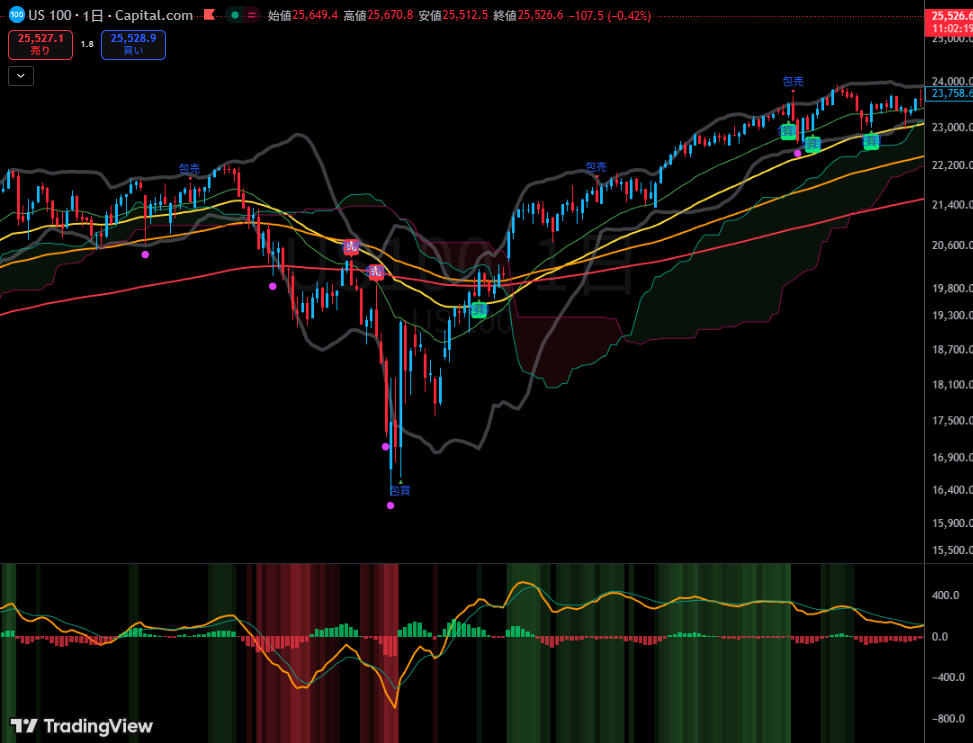
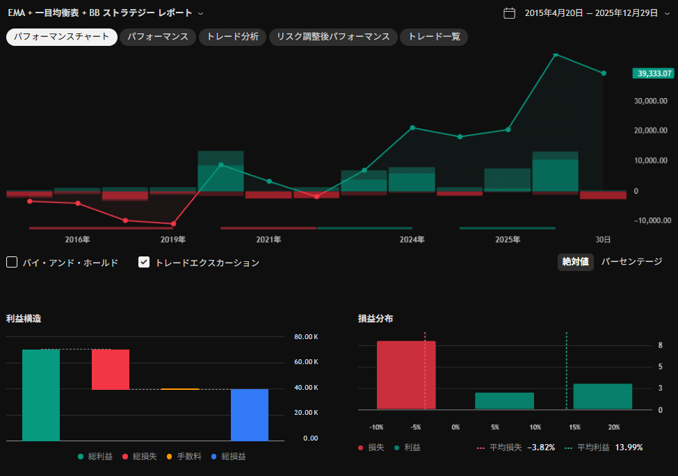

# 🌙 TradingView カスタムインジケーター集


## 📗 プロジェクトの概要

本リポジトリは、TradingView（Pine Script）で作成した  
**オリジナルのインジケーター・ストラテジー・共通ライブラリ**を管理するためのものです。

ロジックの再利用性・保守性を重視し、  
インジケーター／ストラテジー／ライブラリを明確に分離しています。

---

## 🌐動作環境

- TradingView
- Pine Script v5 / v6（※コード内の @version を参照）

「EMA + 一目均衡表 + BB」インジケータ


EMA + 一目均衡表 + BB ストラテジー


---

## 📦 フォルダ構成

```
tradingview-indicators/
├── indicators/
│   ├── adaptive_macd.pine (可変MACDインジケーター)
│   ├── ema_engulfing_ichimoku.pine (EMAクロス + 包み線シグナル + 一目均衡表)
│   └── cclellan_oscillator.pine (マクレラン・オシレーター)
├── strategies/
│   └── ema_rsi_strategy.pine (EMA + RSI Strategy)
├── libraries/
│   └── common_functions.pine (共通関数ライブラリ)
├── README.md
├── CHANGELOG.md
└── LICENSE
````

---

## indicators について

`indicators/` には、**チャート上に表示して利用するインジケーター**を配置します。

### 特徴
- `indicator()` を使用
- チャートへの描画（`plot`, `plotshape`, `fill` など）を担当
- アラート条件（`alertcondition`）を定義
- 売買判断の「見える化」が目的

### 例
- EMAクロス＋包み線＋一目均衡表インジケーター
- トレンド判定用インジケーター
- 補助的なサブインジケーター

> **ルール**  
> - 計算ロジックはできるだけ `libraries/` に切り出す  
> - indicator 側には「表示」と「UI」を残す

---

## strategies について

`strategies/` には、**バックテスト・検証用のストラテジー**を配置します。

### 特徴
- `strategy()` を使用
- エントリー／エグジット条件を定義
- TradingView のバックテスト機能を利用可能
- 実売買の自動化ではなく「検証」が主目的

### 例
- EMA + RSI を使ったトレンドフォロー戦略
- library と共通ロジックを使った検証用コード

> **ポイント**  
> indicator と strategy で **同じ library を使うことで、  
> シグナル条件のズレを防止**できます。

---

## libraries について

`libraries/` には、**複数のインジケーター／ストラテジーで共通利用する関数**を定義します。

### library に含めるもの
- EMA・クロス判定などの計算ロジック
- ローソク足パターン（包み線など）の判定
- 出来高・ボラティリティ・トレンド判定
- 一目均衡表などの計算ロジック

### library に含めないもの
- `plot()`, `plotshape()`, `fill()`
- `input()`
- `alertcondition()`

---

### libraries の利用方法（重要）

#### 1. library 側（例）

```pinescript
//@version=6
library("CommonFunctions")

export ema(src, len) =>
    ta.ema(src, len)

export emaCrossUp(src, shortLen, longLen) =>
    ta.crossover(ta.ema(src, shortLen), ta.ema(src, longLen))
````

#### 2. indicator / strategy 側で import

```pinescript
//@version=6
indicator("Sample", overlay=true)

// ※ 作者名 / ライブラリ名 / バージョン を指定
import YourTradingViewUserName/CommonFunctions/1 cf

plot(cf.ema(close, 25))
```

> ⚠️ 注意
>
> * TradingView 上で **library として保存済み**である必要があります

---

## GitHub と TradingView の関係

* GitHub
  → ソースコード管理・履歴管理の「正本」

* TradingView
  → 実行・表示・バックテストの「実行環境」

GitHub で管理したコードを TradingView に反映する運用を前提としています。

---

## 注意事項（免責）

本リポジトリに含まれるコードは **学習・研究目的**のものです。
実際の投資判断・売買によって生じたいかなる損失についても、
作者は一切の責任を負いません。

---

## 🎫 Licence

[MIT](https://github.com/isystk/tradingview-indicators/blob/main/LICENSE)

## 👀 Author

[isystk](https://github.com/isystk)
